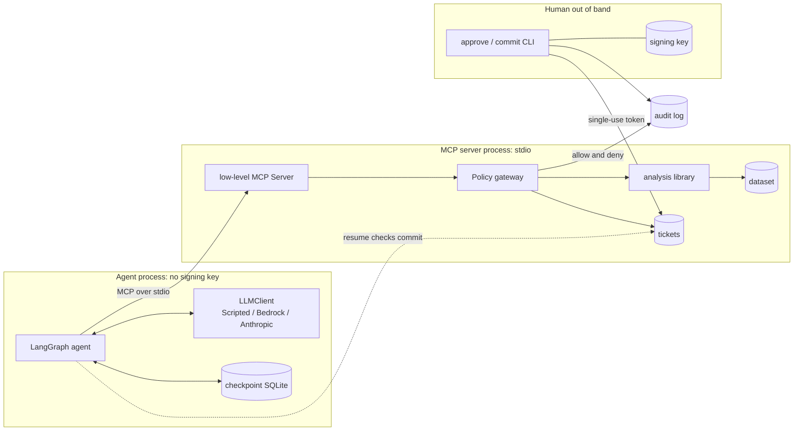

# Architecture

Status: implemented. The verification status of each path is in the README
under "Verified versus not verified".

## 1. Purpose

A LangGraph agent triages yield excursions by calling statistical tools on an
MCP server over stdio. A deterministic policy gateway, which the model cannot
influence, enforces scopes, validation, limits and output marking, and audits
every decision. The agent can draft a ticket but cannot commit one. A person
approves and commits with a separate CLI that holds the signing key.

## 2. Data

- **Source.** UCI SECOM (CC BY 4.0): 1,567 rows and 590 numeric sensors. The
  layout was checked against the download. `secom.data` is space-separated
  with `NaN` for missing values. `secom_labels.data` holds
  `<-1|1> "dd/mm/yyyy HH:MM:SS"`, where -1 means pass and 1 means fail.
  Timestamps are treated as UTC.
- **Units and IDs.** A row is a production unit, identified only by its row
  index and timestamp. Sensor IDs are `s000` to `s589`, by column position.
- **Synthetic mode.** `--synthetic` is seeded and SECOM-shaped. It has 5
  planted sensors that shift for failing units, constant and sparse columns,
  and one sensor with a time-window drift. It is labelled `synthetic`
  everywhere. The ground truth is stored apart from the dataset, so the
  server never sees it.

## 3. Modules

```
src/yield_triage/
  data.py, synthetic.py   Dataset container, SECOM parser, seeded generator
  analysis/               PURE: ranking.py (Mann-Whitney + BH), drift.py (EWMA, WE rules), summary.py
  policy/
    policy.yaml           default-deny tool and scope table, limits, analysis and approval settings
    config.py             strict loader with cross-checks
    models.py             strict pydantic argument schemas
    budget.py             call count and wall-clock deadline
    wrap.py               envelopes, untrusted marking, size fitting
    gateway.py            THE security boundary: runs every control in order and audits
  server/
    tools.py              tool bodies (analysis calls, notes, draft tickets)
    app.py, __main__.py   low-level MCP Server over stdio
    fixtures/maintenance_notes.jsonl   fictional notes with injection payloads
  audit.py, filelock.py   hash-chained JSONL log, cross-process lock
  tickets.py              pending and committed ticket files, content hash
  approvals.py            HMAC tokens, nonce ledger, approve and commit (human side only)
  agent/                  llm.py, prompts.py, mcp_client.py, graph.py, scenarios.py
  cli.py                  yield-triage run | resume | approve | commit | verify-audit | serve
```

**Process boundary.** The MCP server process holds the data, the ticket store
and the audit writer. The agent process holds the LLM client and the graph
checkpoint. The approval CLI is the only code that loads the signing key. The
agent package never imports `approvals`, `run` removes the key variables from
its own environment, and the server subprocess receives an explicit allowlist
of environment variables.

## 4. Diagram



## 5. Agent graph

```
triage -> plan -> tool_loop (repeats, at most 6 turns) -> summarize -> propose -> await_approval
```

- **`triage`** is deterministic: it calls `get_window_summary` before any
  model call, and an empty window ends the run.
- **`plan`** produces text only.
- **`tool_loop`** forwards every tool call the model makes, even unknown
  ones, to the server.
- **`summarize`** asks for a JSON draft.
- **`propose`** sends that draft, unchanged, to `propose_ticket`.
- **`await_approval`** calls LangGraph `interrupt`, and the state is
  checkpointed to SQLite. Later, `yield-triage resume <run_id>` re-enters
  the node and checks whether the ticket file is committed. If it isn't, the
  node pauses again.

## 6. Tools

Timestamps must be ISO-8601 date-times with `Z` or an offset. Windows are
half-open, `[start, end)`.

| Tool | Scope | Input | Output `data` |
|---|---|---|---|
| `get_window_summary` | `read:analysis` | `start`, `end` | `n_units`, `n_fail`, `n_pass`, `fail_rate`, `missing_fraction`, `n_sensors`, `n_sensors_all_missing` |
| `rank_failing_sensors` | `read:analysis` | `start`, `end`, `top_k` (1 to 50) | `status`, `q`, `n_tested`, `n_significant`, `n_dropped_*`, `ranked[{sensor_id, effect_size, p_adj, n_pass, n_fail, significant}]`. Returns `insufficient_data` when there are fewer than 10 failures |
| `check_sensor_drift` | `read:analysis` | `start`, `end`, `sensor_id` (from the allowlist) | `status`, `baseline{mean,std,n}`, `n_monitored`, `n_violations`, `violations[{row_index, timestamp, value, ewma, lower, upper}]` |
| `get_maintenance_notes` | `read:analysis` | `start`, `end` | `notes[{timestamp, text}]`, with **`untrusted: true`** and provenance (source, SHA-256) |
| `propose_ticket` | `write:ticket_draft` | `title`, `body`, `evidence_refs` (call IDs from this run) | `ticket_id`, `content_hash`, `status: pending` |

Every result comes back in an envelope with these fields:
`tool, call_id, decision, dataset, untrusted, provenance, truncated, data`.
A denial returns only `tool, call_id, decision: deny, reason`, plus the names
of the invalid fields when validation fails.

Approve and commit are **not** MCP tools.

## 7. Policy gateway order

1. **Budget.** Every attempt is counted, denials included.
2. **Allowlist and scope.** The tool must be allowed by the profile, and the
   profile must hold the tool's scope (default deny).
3. **Size.** The argument object is checked against a size cap.
4. **Validation.** Strict schema validation, using the sensor allowlist taken
   from the dataset.
5. **Execution.** The tool runs in a worker thread, bounded by the run's
   remaining time.
6. **Envelope.** The result is wrapped, marked untrusted where it carries
   free text, and fitted to the character budget.
7. **Audit.** An audit record is written for both allow and deny.

## 8. Approval tokens

- **Format.** `v1.<payload>.<sig>`. The payload holds the ticket ID, the
  SHA-256 of the canonical `{ticket_id, title, body, evidence_refs}`, an
  expiry (default 900 s) and a nonce. The signature is HMAC-SHA256 under the
  approval key, compared in constant time.
- **Single use.** The nonce is recorded in a ledger under an exclusive lock.
- **Key source.** The key comes from `YIELD_TRIAGE_APPROVAL_KEY` (hex, at
  least 32 bytes) or from a generated key file with mode 0600. Group- or
  world-readable key files are refused on POSIX.

## 9. Audit log

Each record carries `seq, ts, actor, event, run_id, call_id, tool, scope,
args_sha256, decision, reason, rows_scanned, result_bytes, truncated,
prev_hash, hash`, where `hash` = SHA-256(canonical record without `hash`).
`yield-triage verify-audit` reports the first bad sequence number.

## 10. Tests and evaluation

- **`tests/analysis`.** Statistics tests on synthetic ground truth.
- **`tests/security`.** One or more tests per threat, each asserting both the
  block and the audit record.
- **`tests/property`.** Hypothesis tests on argument validation.
- **`tests/integration`.** The real stdio subprocess.
- **`tests/agent`.** Graph flows, including the fooled models, the LLM
  adapters validated with botocore's Stubber, and agent isolation.
- **`make smoke` and `make docker`.** The CLI end to end, both on the host
  and in the container.
- **`make eval`.** Generates the README table.
